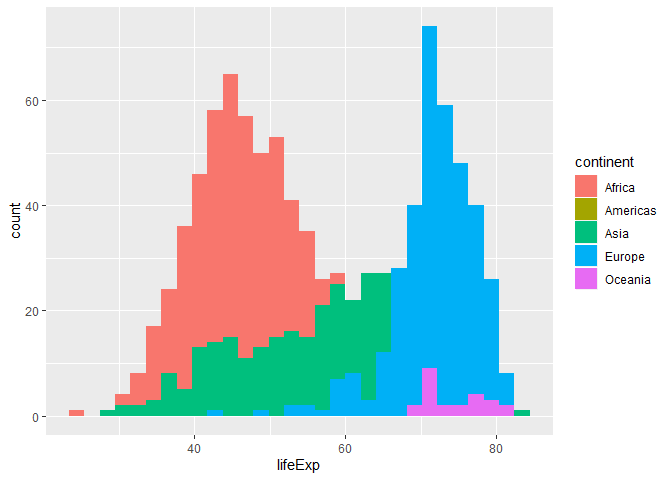
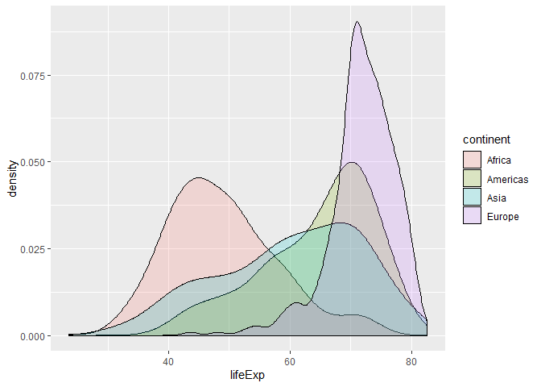
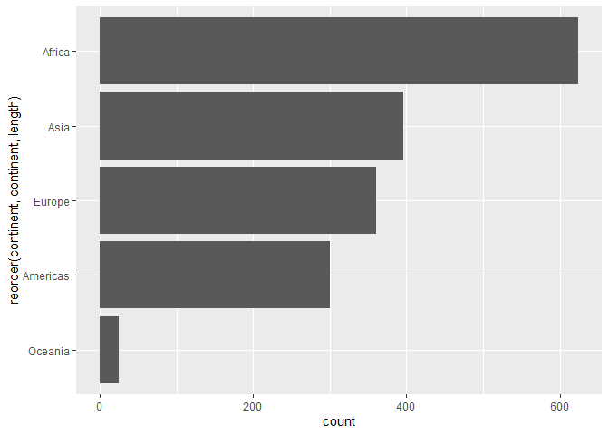

# Exploratory Data Analysis: Data Visualization - Introduction

Requirements:

- GitHub account
- RStudio Cloud account

Goals:

- Create standard data visualizations 
- Use `ggplot2` functions to plot transformations 
- Add new layers to help make important information more visible 
- Add new layers to to summarize visual information

**Pick a lead**:
This person is not solely responsible for doing the activity, but they are responsible for organizing the collective team effort - for example, making sure all parts are completed and pushing them to the Team GitHub repo.

## Introduction

This activity builds on our current understanding of `ggplot2` for data visualizations.
This activity is based on Jenny Bryan's [ggplot2 tutorial](https://github.com/jennybc/ggplot2-tutorial).

In your first Application Task, you explored the `gapminder` data set.
In this activity, we will go through a methodical process of creating effective (easy for the audience to decode) visualizations.

Before get to the activity, let's get into a mindset of things to avoid:

- [Ugly Charts](https://flowingdata.com/category/visualization/ugly-visualization/)
- [r/dataisugly](https://www.reddit.com/r/dataisugly/)
- [WTF Visualizations](https://viz.wtf/)

## Getting started

Now that your Teams are set-up in GitHub Classroom, these instructions will be how we access Team Activities from now on.
For now, we are still relying on only one Team Member (the lead) pushing the complete activity, but the others are expected to contribute to the discussion and help the lead member complete the step, but not *push* the files from their computer (they should be able to pull, though).

1. *All* Team Members:
  - Go to the Documents section on [Bb](https://mybb.gvsu.edu)
  - Click on the link titled `activity0204`
  - Click on the "Join" button next to your corresponding team name in the **Join an existing team** section
2. *All* Team Members now will:
  - In your team repo, click the green **Clone or download** button, select "Use HTTPS" if this isn't the default option, and click on the clipboard icon to copy the repo URL
  - Go to RStudio Cloud and into the course workspace.  Create a **New Project from Git Repo** - remember that you need to click on the down arrow next to the **New Project** button to see this option.
  - Paste the URL of your activity repo into the dialogue box.
  - Click "OK".
3. *All* Team Members now will Load Package:
  - In this lab, we will work with the `tidyverse` and `gapminder` packages so we need to install and load it.
    Type the following code into your *Console*:
  
    
    ```r
    install.packages("tidyverse")
    library(tidyverse)
    ```
    
    
    ```r
    install.packages("gapminder")
    library(gapminder)
    ```
    
  - Note that this package is also loaded in your R Markdown document.
4. *All* Team Members now will configure Git:
  - Go to the *Terminal* pane and type the following two lines of code, replacing the information inside the quotation marks with your GitHub account information:
  
    
    ```bash
    git config --global user.email "your email"
    git config --global user.name "your name"
    ```
    
  - Confirm that these changes have been implemented, run the following code:
  
    
    ```bash
    git config --global user.email
    git config --global user.name
    ```
        
  - Inform git that you want to store your GitHub credentials for $60 \times 60 \times 24 \times 7 = 604,800$ seconds, run the next line of code.  This needs to be done on a per-project basis.
  
    
    ```bash
    git config --global credential.helper 'cache --timeout 604800'
    ```
    
5. *All* Team Members will now name their RStudio project:
  - Currently your RStudio project is called *Untitled Project*.  Update the name of your project to be "Activity 2-4 - Data Visualization Intro"
6. The *Lead* Team Member to do the following in RStudio:
  - Open the `.Rmd` file and update the **YAML** by changing the author name to your **Team** name and date to today, then knit the document.
  - Go to the *Git* pane and click on **Diff** to confirm that you are happy with the changes.
  - *Stage* just your Rmd file, add a commit message like "Updated team name" in the *Commit Message* dialogue box and click **Commit**
  - Click on **Push**.  This will prompt a dialogue where you first need to enter your GitHub user name, and then your password - this should be the only time you need to do this for the current activity.
  - Verify that your changes have been made to your GitHub repo.
7. *All other* Team Members now will do the following in RStudio:
  - Go to the *Git* pane and click on **Pull** button.  This will prompt a dialogue where you first need to enter your GitHub user name, and then your password (this should be the only time you need to do this for the current activity).
  - Observe that the changes are now reflected in their project!

Again, only one team member will be pushing the changes.
All others are encouraged to work and save changes "locally" in RStudio.Cloud, but not push.

## The data

By this point, you should be familiar with Hans Rosling's gapminder data set.
This data set has good combination of quantitative and qualitative variables - along with some spectacular insight that we can make.

## Exploratory Data Analysis

### Scatterplot

One of the visualizations that you created in Application Task 1 was to explore the relationship between `gdpPercap` and `lifeExp`.
In your `Rmd` file, I provide you with the following code that produces an empty canvas:


```r
p <- ggplot(data = my_gm, aes(x = gdpPercap, y = lifeExp))
```

***
**Exercise 1**:
Using the environment element `p`, *add* the layer to make a scatterplot.
Comment on the relationship that you see.
From a "STA 216" (linear models) perspective, what concern do you have with this plot?

***

There are a couple of ways to alleviate this concern:

1. Transform the variable that you are plotting (e.g., `x = log10({x-variable-name})` or `y = log10({y-variable-name})`).
2. Transform the appropriate axes (i.e., `+ scale_x_log10()` or `+ scale_y_log10()`).

***
**Exercise 2**:
Which of these options, transforming the variable or altering the axis, is the better option?
Explain your reasoning and implement your choice.

***

Regardless of your decision in Exercise 2, we will continue with this updated plot - so that we all are on the same page.
Add the following code to your Rmd file before completing Exercise 3.


```r
p <- ggplot(data = my_gm, aes(x = gdpPercap, y = lifeExp)) +
  scale_x_log10()
```

***
**Exercise 3**:
Run and explain what each of the following geoms does to your plot.
Be sure to mention what each argument in the function (the formals) controls.


```r
p + geom_point(alpha = (1/3), size = 3)
```


```r
p + geom_point() + 
  geom_smooth(lwd = 3, se = FALSE, method = "lm")
```


```r
p + aes(color = continent) + 
  geom_point() + 
  geom_smooth(lwd = 3, se = FALSE)
```

***

***
**Exercise 4**:
Using any combination of the geoms from Exercise 3, include `facet_wrap(~ continent)`.
Comment on your final plot.

***

### Time series plots

Time series plots show how values change over time.
In the next three plots, we explore how `lifeExp` changes over time.


```r
ggplot(my_gm, aes(x = year, y = lifeExp, color = continent)) +
  facet_wrap(~ continent, scales = "free_x") +
  geom_jitter(alpha = 1/3, size = 3) +
  scale_color_manual(values = continent_colors)
```


```r
my_gm %>% 
  filter(continent != "Oceania") %>% 
  ggplot(aes(x = year, y = lifeExp, group = country, color = country)) +
  geom_line(lwd = 1, show.legend = FALSE) + facet_wrap(~ continent) +
  scale_color_manual(values = country_colors)
```


```r
ggplot(my_gm, aes(x = year, y = lifeExp, color = continent)) +
  facet_wrap(~ continent, scales = "free_x") +
  geom_jitter(alpha = 1/3, size = 3) +
  scale_color_manual(values = continent_colors) +
  geom_smooth(lwd = 2)
```

***
**Exercise 5**:
A lot occurred in these three plots.
Explore each plot.
What do you notice between the code and the graphic?

***

### Distribution across groups

Recall that boxplots are a great way to compare order statistics (specifically quartiles) between different groups.
I like to superimpose the data points over top of boxplots to get a better sense of how the data are distributed.
Explore this code with using `geom_point()` instead of the `geom_jitter(...)` layer.


```r
ggplot(my_gm, aes(x = continent, y = lifeExp)) +
  geom_boxplot(outlier.colour = "hotpink") +
  geom_jitter(position = position_jitter(width = 0.1, height = 0), alpha = 1/4)
```

***
**Exercise 6**:
Explore this code with using `geom_point()` instead of the `geom_jitter(...)` layer.
Why would making the `height` argument a value other than `0` be ill-advised?

***

Another way to view the distribution of data are with histograms.


```r
ggplot(my_gm, aes(x = lifeExp, fill = continent)) +
  geom_histogram(position = "identity")
```

<!-- -->

***
**Exercise 7**:
Where are the Americas in this plot?
What does the `position = "identity"` argument do?

***

Since there are only two countries, we might consider ignoring Oceania.
The `geom_density` provides us with a smoothed version of the histogram.


```r
ggplot(subset(my_gm, continent != "Oceania"), aes(x = lifeExp, fill = continent)) +
  geom_density(alpha = 0.2)
```

<!-- -->

***
**Exercise 8**:
Using the density plot code, explore `facet_wrap(~ continent)`, `facet_grid(contient ~ .)`, and `facet_grid(. ~ continent)`.
How do these layers compare?
How do they differ?

***

### Bar charts

For a single qualitative variable, it is hard to beat a good ole bar chart.
`geom_bar` works like `dplyr::count` in that it summarizes the variable passed through it (i.e., the default stat is "bin").

***
**Exercise 9**:
Using your `dplyr` skills from Activity 2.2, get the number of observations for each continent.
Assign this output to `continent_freq`.

***

Your values should be the same as the height of each bar in this chart.
Note that I ordered the bars by frequency and flipped the axes.


```r
ggplot(my_gm, aes(x = reorder(continent, continent, length))) + 
  geom_bar() +
  coord_flip()
```

<!-- -->

***
**Exercise 10**:
Reproduce this bar chart using the summary table that you created for Exercise 8 (`continent_freq`).
`stat = "identity"` will be helpful in completing this exercise.

***

Have your **Lead Team Member** commit and push the final activity to your Team's repo.
